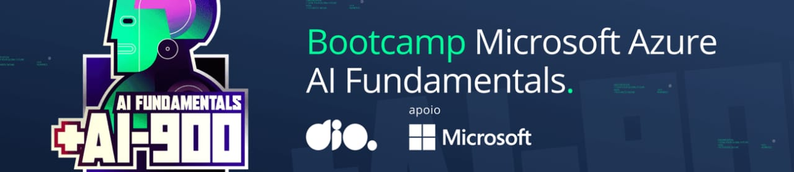

# Desafios do Bootcamp Certificação AI-900 da Microsoft

Este repositório contém os desafios propostos no Bootcamp de Certificação AI-900 da Microsoft do curso Microsoft Azure AI Fundamentals da Dio. [Link do curso](https://web.dio.me/track/microsoft-azure-ai-fundamentals)

## Sobre o Bootcamp

O Bootcamp de Certificação AI-900 da Microsoft oferece uma oportunidade para os participantes aprenderem sobre os conceitos fundamentais de Inteligência Artificial (IA) e como aplicá-los em diversas áreas. Este curso abrange tópicos como conceitos básicos de IA, aprendizado de máquina, visão computacional, IA Generativa, ética e privacidade de dados, além de fornecer uma visão geral das ferramentas e serviços disponíveis na plataforma Azure da Microsoft.

## Objetivo deste Repositório

Este repositório foi criado para armazenar os desafios práticos propostos ao longo do Bootcamp de Certificação AI-900. Cada desafio aborda um aspecto específico da IA e é projetado para testar e aprimorar as habilidades práticas dos participantes.

## Como Contribuir

Se você participa do Bootcamp AI-900 e deseja contribuir com soluções para os desafios ou propor novos desafios, sinta-se à vontade para fazer um fork deste repositório, adicionar suas contribuições e enviar um pull request. Suas contribuições são muito bem-vindas!

